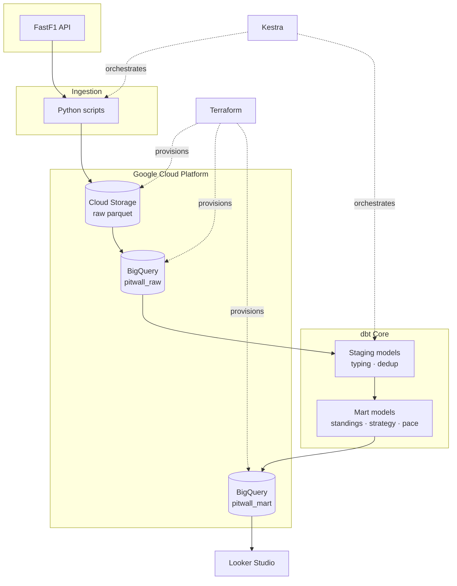

# PitWall — F1 Race Intelligence Pipeline

A data pipeline that pulls Formula 1 timing data, loads it into BigQuery, transforms it with dbt, and feeds a Looker Studio dashboard. Built as my capstone for the DataTalksClub Data Engineering Zoomcamp.

## Problem

F1 publishes a huge amount of timing data every race weekend. Lap times, tyre compounds, pit stops, weather readings, all of it. The problem is that it sits behind an API in a shape that's hard to ask questions of.

I wanted to be able to answer things like how a title race actually unfolded round by round, which tyre compounds fall off fastest, and whether pole position matters more at some circuits than others. None of that is a single query against the raw source.

So PitWall ingests five seasons of F1 data, models it properly in a warehouse, and puts a dashboard on top of it.

## Architecture

```
FastF1 API → Python ingestion → GCS (parquet) → BigQuery (raw)
→ dbt (staging → marts) → Looker Studio
```

Kestra handles orchestration. Terraform manages the GCP infrastructure.



## Stack

| Layer | Tool |
|---|---|
| Source | FastF1 |
| Ingestion | Python |
| Data lake | Google Cloud Storage |
| Warehouse | BigQuery |
| Transformations | dbt Core |
| Orchestration | Kestra |
| Infrastructure | Terraform |
| Dashboard | Looker Studio |

## How the warehouse is built

Raw tables land exactly as FastF1 returns them. Nothing is cleaned at this stage on purpose, so I can always go back to the source data if something looks wrong downstream.

dbt then builds two layers on top.

**Staging** does the boring but necessary work. Casting types, renaming columns to snake case, and deduplication. The dedup matters more than I expected. While I was debugging the ingestion script I reran it several times, which appended duplicate rows. A `row_number()` window function partitioned by the natural key and ordered by load time keeps only the most recent copy of each row.

**Marts** are the analytics tables. The interesting ones:

`mart_driver_standings` computes cumulative championship points using a window function over rounds, then ranks drivers at each round to give championship position after every race.

`mart_final_standings` was a fix for a subtle bug. My first version of the season standings filtered to the final round, which quietly dropped anyone who left mid-season. Ricciardo scored points in 2024 but wasn't on the grid in Abu Dhabi, so he vanished. Taking each driver's last row instead of the last round fixes it.

`mart_tyre_strategy` builds stints from lap by lap compound data using a gaps and islands pattern. A new stint starts on lap 1 or on any lap where the driver came out of the pits, so a running sum over those markers gives stint numbers, which then group into stints.

### Partitioning and clustering

`mart_lap_times` (about 103k rows) and `mart_race_results` are partitioned by season using integer range partitioning, and clustered by driver and round.

The reason is that every dashboard query filters by season, and most also filter by driver or round. Partitioning by season means a query for 2024 only reads the 2024 partition instead of scanning everything, and clustering sorts rows within each partition so filters on driver skip blocks that can't match.

The smaller marts are deliberately not partitioned. Standings and calendar tables are a few thousand rows at most, and below roughly a gigabyte the partition metadata costs more than the pruning saves.

## Data quality

This turned out to be the part of the project I spent the most time on, and probably learned the most from.

The standings looked wrong the first time I checked them. Verstappen's 2024 total came out at 462 when the real number is 437. Too high, which pointed at duplicates rather than missing data, and traced back to my debugging reruns. Adding dedup to staging fixed it.

Then the number was too low. Digging into it round by round, the US Grand Prix showed zero points for a race he finished third in. The raw row had null points, so I deleted that session and reingested it.

Checking for the same problem elsewhere turned up a lot of null points rows, but almost all of them were qualifying sessions, which is correct since qualifying doesn't award points. Only one other race session had the problem.

After those fixes the 2024 total came to 399. Sprint races account for 38 of the missing points, so 399 plus 38 is 437, which matches. I checked the same way for every season and the top three in each one lines up with the official results once sprints are accounted for.

The last problem was worse and took longer to spot. The 2026 season data went in fine through the scheduled flow, but when I compared seasons in the marts, 2023 was missing entirely. The historical load had skipped the whole season because the FastF1 rate limiter kicked in, and my `try/except` caught every failure and moved on without making any noise about it. Two more seasons were missing their final round for the same reason.

So I wrote `validate_completeness.py`, which compares the rounds actually loaded against the rounds each season should have and exits with a non-zero status if anything is missing. Catching gaps loudly is better than resilient code that hides them.

### Known limitations

Sprint sessions aren't ingested, so standings for seasons with sprints sit below the official totals by the sprint points amount. It's verified and documented rather than hidden, and adding sprints is the obvious next improvement.

Kestra runs locally in Docker, which means the scheduled flow only fires while my machine is on. In production it would live on a VM or Kestra Cloud.

FastF1 rate limits at 500 calls per hour, so bulk loading needs pacing. The historical load sleeps 30 seconds between sessions and still takes a few hours.

The Kestra flows pip install their dependencies on every run. It works but it's wasteful, and building a custom Docker image with the dependencies baked in would be better.

## Dashboard


Four pages:

1. **Season overview** — standings, points progression by round, wins and DNFs by team
2. **Driver performance** — clean lap pace, grid versus finish, positions gained
3. **Race strategy** — tyre stints, pit stop timing, degradation curves by compound
4. **Circuit stats** — pole to win conversion, average pit stops per circuit

The lap time charts filter on an `is_clean_lap` flag rather than deleting slow laps in the model. Safety car laps and in/out laps are still real data and matter for strategy analysis, they just shouldn't pollute a pace comparison.

## Running this yourself

You'll need Python 3.10 or later, Docker, Terraform, and a GCP project with BigQuery and Cloud Storage enabled.

Create a service account with BigQuery Admin and Storage Admin roles and download the JSON key. I create this by hand rather than in Terraform, because doing it in Terraform means giving the pipeline service account permission to manage IAM, which is more access than a pipeline should have.

```bash
git clone https://github.com/selomcaleb/PitWall-F1-Race-Intelligence-Dashboard.git
cd PitWall-F1-Race-Intelligence-Dashboard
pip install -r requirements.txt
```

Copy the example config files and fill in your own values:

```bash
cp .env.example .env
cp terraform/terraform.tfvars.example terraform/terraform.tfvars
```

Provision the bucket and datasets:

```bash
cd terraform
terraform init
terraform apply
cd ..
```

Check the setup works before committing to a long load:

```bash
python ingestion/test_fastf1.py
python ingestion/create_tables.py
```

Load the data. This takes a few hours because of the rate limits:

```bash
python ingestion/ingest_historical.py
python ingestion/validate_completeness.py
```

Build the models:

```bash
cd dbt/pitwall_dbt
dbt run
dbt test
```

Start Kestra and create the flows by pasting the YAML from `orchestration/flows/` into the UI:

```bash
cd orchestration
docker compose up -d
```

Kestra runs at http://localhost:8080.

To ingest a single race weekend after that, either run the parameterised flow from the Kestra UI with a season and round, or:

```bash
python ingestion/ingest_race_weekend.py --season 2026 --round 10
```

## Project structure
```
PitWall-F1-Race-Intelligence-Dashboard/
├── ingestion/
│   ├── ingest_session.py           # Core ingestion: one session → GCS + BigQuery
│   ├── ingest_race_weekend.py      # CLI: ingest Q + R for a given season/round
│   ├── ingest_latest.py            # Auto-detects and ingests the latest completed round
│   ├── ingest_historical.py        # Bulk historical load across seasons
│   ├── validate_completeness.py    # Reconciles loaded rounds against expected per season
│   ├── create_tables.py            # Creates raw BigQuery tables
│   ├── schemas.py                  # Raw table schema definitions
│   └── test_fastf1.py              # Setup smoke test
├── dbt/
│   └── pitwall_dbt/
│       ├── dbt_project.yml
│       └── models/
│           ├── staging/            # Views: typing, renaming, deduplication
│           │   ├── sources.yml     # Raw source definitions + column docs
│           │   ├── schema.yml      # Model tests and documentation
│           │   └── stg_*.sql       # sessions, results, laps, pit_stops, weather, drivers, circuits
│           └── mart/               # Tables: analytics-ready models
│               ├── mart_race_results.sql
│               ├── mart_driver_standings.sql       # Cumulative points via window functions
│               ├── mart_final_standings.sql
│               ├── mart_constructor_standings.sql
│               ├── mart_lap_times.sql              # Partitioned by season, clustered by driver
│               ├── mart_tyre_strategy.sql          
│               ├── mart_pit_stops.sql
│               ├── mart_qualifying_results.sql
│               ├── mart_season_calendar.sql
│               └── mart_circuit_stats.sql
├── orchestration/
│   ├── docker-compose.yml          
│   └── flows/
│       ├── pitwall_race_weekend.yml     
│       └── pitwall_scheduled_ingest.yml 
├── terraform/
│   ├── main.tf                    
│   ├── variables.tf
│   └── terraform.tfvars.example
├── requirements.txt
├── .env.example
└── README.md
```
